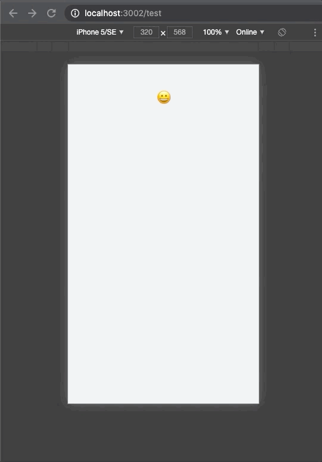

# use-router-layer
> This library is a react hook library that facilitates layer management. It can easily control layer displayed through the browser's `backward` or `forward` functions by mapping layer information displayed on the screen to URL information.


> A greeting layer is displayed or not displayed depending on the URL change.

## Installation

The easiest way to install `use-router-layer` is with [npm](https://www.npmjs.com/package/use-router-layer).

```bash
npm install use-router-layer
```

Alternately, download the source.

```bash
git clone https://github.com/stegano/use-router-layer.git
```

## Features
```ts
const useRouterLayer = (
  /**
   * Layer component to be displayed on the screen.
   */
  $component: JSX.Element| null = null,
  /**
   * URL information including QueryString.
   */
  url: string = '',
  /**
   * The name of the queryParameter to use as the `layerName`.
   */
  qsLayersName: string = '__layers__',
  /**
   * The name to use as the `layerId` value.
   */
  qsLayerId: string = 'layerId',
  /**
   * Bind a pushState function that can change the browser URL.
   */
  pushFn: (url: string) => any,
  /**
   * Binds a function that can call the browser back function.
   */
  backFn: () => any,
) : [
  JSX.Element | null,
  Function,
  Function,
  boolean
] => {
  ...
return [
    /**
     * It is a `$layerComponent` entered as a factor. This component may or may not be displayed depending on the URL state.
     */
    $layerComponent, 
    /**
     * Changes the URL state so that the `$layerComponent` can be displayed on the screen.
     */
    showLayer, 
    /**
     * Change the URL state so that the layer does not appear on the screen.
     */
    closeLayer, 
    /**
     * Whether the layer component is displayed or not.
     */
    isShowLayer
  ];
};
```

## Usage
```ts
// component.tsx

import React from 'react';
import useRouterLayer from 'use-router-layer'
import GreetingLayer from 'src/layers/greeting';
...

/**
 * useRouterLayerForReact
 * @param $layerComponent 
 * @param qsLayersName 
 * @param qsLayerId 
 */
const useRouterLayerForReact = <T extends JSX.Element | null>(
  $layerComponent: T | null = null,
  qsLayersName: string = 'layers',
  qsLayerId: string = 'myLayerId',
) => {
  const location = useLocation();
  return useRouterLayer(
    $layerComponent,
    location.search,
    qsLayersName,
    qsLayerId,
    (urlWithQuery: string) => {
      useHistory.go(urlWithQuery);
    }, useHistory.goBack,
  )
};

/**
 * useRouterLayerForNextjs
 * @param $layerComponent 
 * @param qsLayersName 
 * @param qsLayerId 
 */
const useRouterLayerForNextjs = <T extends JSX.Element | null> (
  $layerComponent: T | null = null,
  qsLayersName: string = 'layers',
  qsLayerId: string = 'myLayerId',
) => {
  const router = useRouter();
  return useRouterLayer(
    $layerComponent,
    router.asPath,
    qsLayersName,
    qsLayerId,
    (urlWithQuery: string) => {
      router.push(urlWithQuery, undefined, {
        shallow: true,
      });
    }, router.back,
  );
}

const Component = () => {
  const [
    $greeting, showLayer, closeLayer
  ] = useRouterLayerForNextjs<JSX.Element>( // or useRouterLayerForReact
    <GreetingLayer/>, 'layers', 'greeting',
  );

  const handleClickShowLayer = () => {
    /**
     * When the code below is executed, your browser URL will be `/?layers=greeting` and the `GreetingLayer` component displayed.
     */
    showLayer();
  };

  const handleClickCloseLayer = () => {
    /**
     *  When the code below is executed, `/?layers=greeting` will be removed from your browser URL, and `GreetingLayer` component will not be displayed.
     */
    closeLayer();
  };

  return (
    ...
    {$greeting}
    ...
  )
};
```
